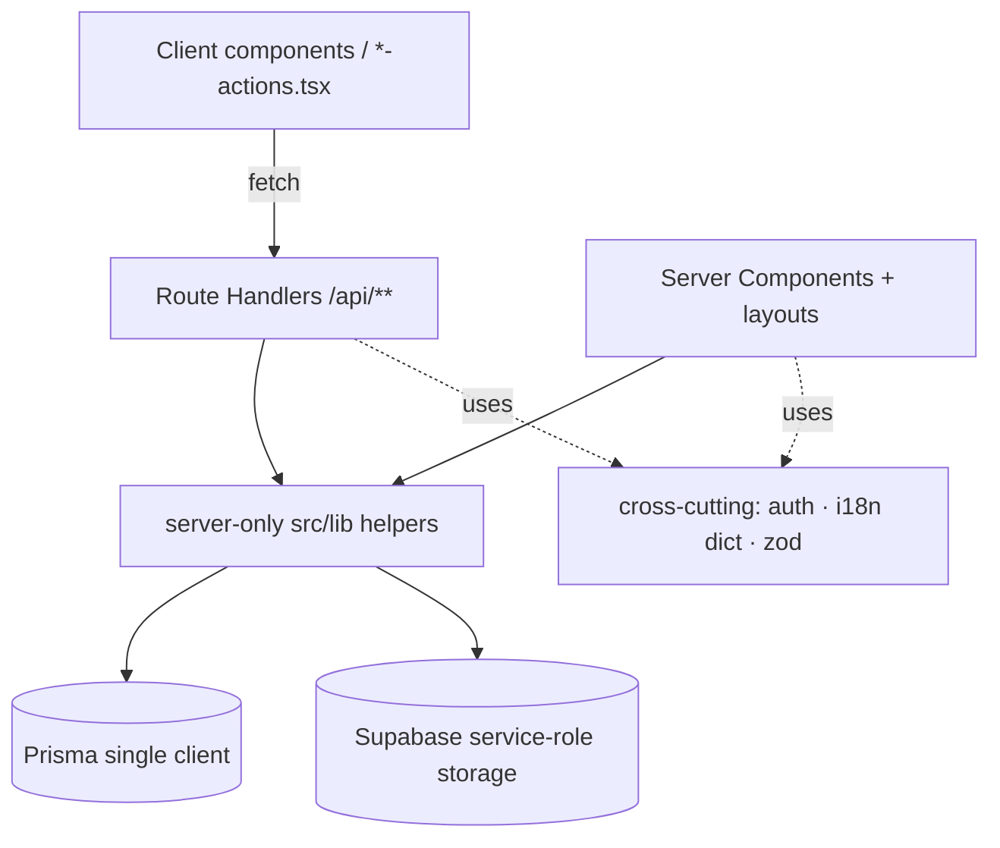
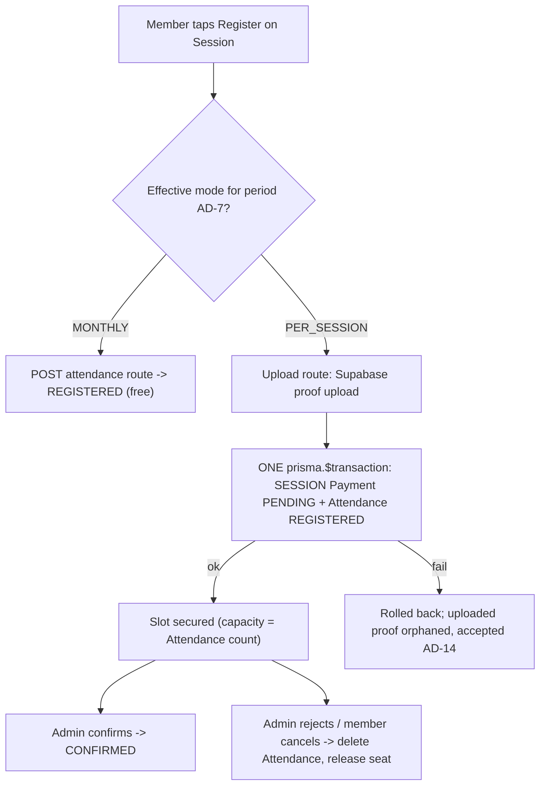
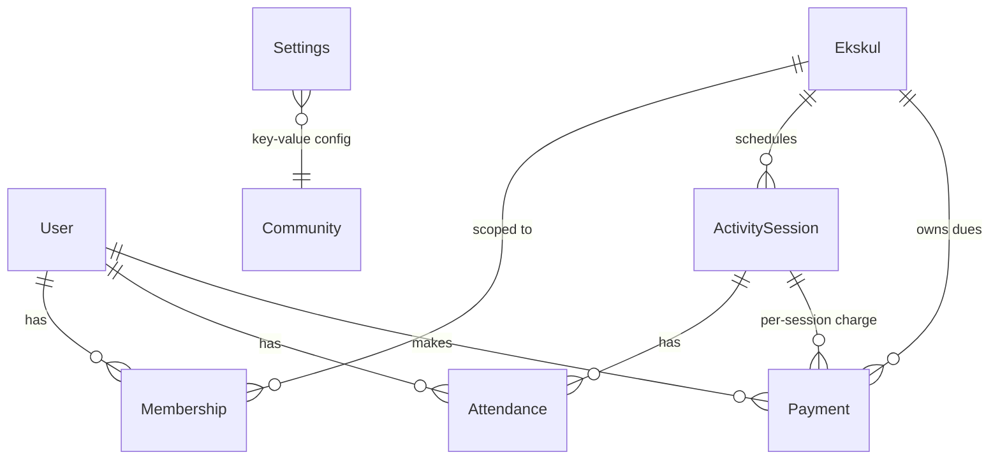

# Architecture Spine — net-c-management Rebrand, Payment Modes & UI/UX Refresh

This is a brownfield spine. Most invariants below already hold in code and are **[ADOPTED]** — ratified so the new work cannot diverge from them. The genuinely new forks are the payment-mode data model (AD-4, AD-5, AD-8), the pre-pay-on-register flow (AD-6), member-mode resolution (AD-7), and the cross-cutting money primitives they all lean on (AD-13 billing period, AD-14 transaction/compensation).

## Design Paradigm

**Layered, server-first Next.js App Router monolith.** Layers map to directories; dependencies point one way only (see AD-1 diagram).

| Layer | Lives in | Role |
| --- | --- | --- |
| Presentation | `src/app/**` Server Components (default); interactivity split into client `*-actions.tsx` / components | Render + collect input; **read** only |
| Mutation API | `src/app/api/**/route.ts` (REST Route Handlers) | The **only** write path; auth-gate → validate → persist |
| Domain / data helpers | `src/lib/*.ts` (`import 'server-only'`) — `ekskul.ts`, `settings.ts`, `supabase.ts`, `validations/*` | Reusable server-side reads + storage; no HTTP |
| Data | `src/lib/prisma.ts` (single client, `@prisma/adapter-pg`) | Postgres access |
| Cross-cutting | `auth.ts`, `proxy.ts`, `i18n/dictionaries.ts`, zod schemas | auth, routing guards, i18n, validation — used by all upper layers |

## Invariants & Rules

### AD-1 — Single mutation boundary [ADOPTED]
- **Binds:** all
- **Prevents:** two competing write paradigms (Route Handler vs Server Action) the next builder could pick between
- **Rule:** every state change goes through a Route Handler under `src/app/api/**`. Server Components and `src/lib` helpers are read-only. Do **not** introduce Next.js Server Actions. `src/lib` never imports from `src/app`.



### AD-2 — Per-route auth/authz contract [ADOPTED]
- **Binds:** every Route Handler; new payment-mode + Activity-fee routes
- **Prevents:** ad-hoc or missing authorization on new endpoints; `OWNER` being locked out of admin gates
- **Rule:** `await auth()` → 401 if no `session.user.id`; `isAdminRole(role)` → 403 for admin-only mutations (never compare `role === 'ADMIN'`; `OWNER` must pass); `zod.safeParse(body)` → 400 `{ error, details }`. Page access is enforced **twice** — `proxy.ts` matcher **and** the route-group `layout.tsx` guard. A new protected route updates both.

### AD-3 — Activity (ekskul) data scoping is a security invariant [ADOPTED]
- **Binds:** all member-facing reads and writes, including every new per-session/payment query
- **Prevents:** cross-ekskul data leak — a member seeing or paying into an Activity they do not belong to
- **Rule:** member reads are scoped by `getUserEkskulIds(userId)`; member mutations are gated by `assertMembership(userId, ekskulId)`. Any new query that returns member-scoped data MUST be ekskul-scoped. Admin/Owner (`isAdminRole`) see all.

### AD-4 — `Payment` is the single money model
- **Binds:** FR-11, FR-12; all monthly and per-session billing
- **Prevents:** two payment owners with divergent proof/confirm flows; a parallel `SessionPayment` model drifting from `Payment`; inconsistent reporting/scoping on per-session rows
- **Rule:** extend the existing `Payment` model — add `type PaymentType` (`MONTHLY | SESSION`) and nullable `sessionId` (FK → `ActivitySession`). Do **not** create a separate session-payment model. Per-session charges reuse the same `proofUrl` / `proofPath` / `status` / `confirmedBy` / `confirmedAt` columns and the same proof→confirm flow. **Temporal/scoping shape of a SESSION row (pinned, not optional):** `month`/`year` are **derived from `ActivitySession.date`** (so the existing `?month=`/`?year=` filters and admin stats include per-session payments); `ekskulId` equals the session's `ekskulId` (keeps AD-3 scoping uniform); `amount` is **computed server-side** from the session fee and **never** trusted from the client (see AD-2, AD-8).

### AD-5 — Payment uniqueness is mode-partitioned, with a pinned write pattern
- **Binds:** FR-11, FR-12, AD-4, AD-12
- **Prevents:** the legacy `(userId, ekskulId, month, year)` unique blocking a second per-session payment in the same month; *and* two builders writing payments incompatibly (one re-adding the forbidden unique, one doing a racy find-then-create)
- **Rule:** drop the unconditional `@@unique([userId, ekskulId, month, year])`. Enforce instead, and write accordingly:
  - **SESSION rows** → native `@@unique([userId, sessionId])` (null `sessionId` on monthly rows never collides in Postgres). Written with `prisma.payment.upsert` on that key.
  - **MONTHLY rows** → a **partial** unique index `(userId, ekskulId, month, year) WHERE type = 'MONTHLY'`, applied via raw SQL (AD-12) because Prisma `@@unique` cannot express it. Written with a **transactional insert-or-update** (`INSERT … ON CONFLICT … DO UPDATE` via `prisma.$executeRaw`, or a guarded transaction) — **not** `prisma.payment.upsert`, which cannot target a partial index. The existing monthly upload upsert migrates to this pattern.

### AD-6 — Per-session billing is pre-pay-on-register (one owning endpoint, atomic)
- **Binds:** FR-10, FR-12; the per-session register path, `/api/sessions/[id]/attendance` (POST **and** DELETE), and the admin reject path `PATCH /api/payments/[id]`
- **Prevents:** a per-session member holding a free slot; two builders securing the slot via different endpoints/orderings; capacity counted inconsistently; an unowned reject/cancel cascade
- **Rule:** for a member whose effective mode (AD-7) for the Activity is `PER_SESSION`:
  - The slot is secured by the **payment upload route**, which — after a successful Supabase proof upload — creates the SESSION `Payment` (PENDING) **and** the `REGISTERED` `Attendance` together in **one `prisma.$transaction`** (AD-14). The slot is secured at proof upload (`Payment ≥ PENDING`), not at admin confirmation.
  - The free `POST /api/sessions/[id]/attendance` route **rejects** per-session members (payment-required); only `MONTHLY`-mode members register free there.
  - **Capacity authority = `Attendance` count** (`REGISTERED`/`PRESENT`) — the single source; a payment alone never holds a seat (they are created atomically).
  - A `REJECTED` payment (admin `PATCH`) or a member cancel (attendance `DELETE`) **releases the seat** (removes the paired `Attendance`).
  - `[ASSUMPTION: secured at upload (PENDING), not at admin-confirm — per UX spine; confirm.]`



### AD-7 — `Membership` owns the member's payment mode, resolved per period
- **Binds:** FR-10; AD-6 (the mode AD-6 reads); AD-13
- **Prevents:** mode inferred from "latest Payment"; a mid-period switch retroactively changing what is owed; two builders computing "current period" differently (calendar vs join-anniversary)
- **Rule:** the chosen mode lives on `Membership` (`PaymentMode` enum `MONTHLY | PER_SESSION`) — the single source, never inferred from payments. The **effective mode for a billing period is a function of that period** (AD-13 calendar `month`/`year`), not a bare mutable-column read: a switch sets an `effectiveFrom` = the **next** period and never changes how the current period resolves (current period immutable). `[ASSUMPTION: stored as `paymentMode` + `effectiveFrom (YYYYMM)` (with a pending value) on `Membership` for v1; if richer history is needed, replace with an effective-dated child record. The period-function invariant is fixed either way.]`

### AD-8 — Activity (`Ekskul`) owns all fees and allowed modes; amounts snapshot on charge
- **Binds:** FR-7, FR-8, FR-9, FR-15
- **Prevents:** a second home for the monthly fee (the duplication this PRD exists to kill); a member selecting a mode the Activity does not offer; a later fee edit silently rewriting what members already owe
- **Rule:** the Activity is the single source for money config: `monthlyFee` (consolidated monthly dues — repurpose existing `defaultFee`), new `sessionFee` (per-session default; `ActivitySession.fee` defaults from it, overridable per Session), and `allowsMonthly` + `allowsPerSession` booleans (**at least one true**, enforced in the zod schema and the route). The global `Settings.defaultMonthlyFee` is removed entirely; Activity fee is an explicit required input on create/edit (no silent `0`).
  - **Snapshot rule:** `Payment.amount` snapshots the applicable fee **at charge creation**; later Activity-fee edits never retroactively change existing `Payment` rows. New/future charges read the **live** Activity fee.
  - **Mode-disable is not retroactive:** turning off an allowed mode does not change current-period members on it — they keep it for the current period and must switch for the next (AD-7).
  - `[ASSUMPTION: rename defaultFee → monthlyFee for clarity; optional — keeping the name is acceptable.]`

### AD-9 — `BadmintonSession` → `ActivitySession` rename, ahead of payment work [ADOPTED · FR-6]
- **Binds:** FR-6; sequencing of all schema work
- **Prevents:** a name collision with NextAuth's `Session`; the payment-mode change racing the rename on the same models
- **Rule:** rename model `BadmintonSession` → `ActivitySession` and propagate: accessor `prisma.activitySession`, relations (`Ekskul.sessions`, `Attendance.session`), `src/app/api/sessions/**` routes, and `@prisma/client` type imports. The name MUST NOT be plain `Session`. This rename lands **before** the payment-mode data model (AD-4..AD-7), since both touch the Session/Payment models.

### AD-10 — Community & Activity identity is data, never hardcoded [ADOPTED · FR-1..FR-5]
- **Binds:** FR-1, FR-2, FR-3, FR-4, FR-5
- **Prevents:** sport-specific or "PB Net-C" copy leaking back in; identity baked into components instead of Settings
- **Rule:** brand identity comes from `Settings.communityName` (neutral defaults: en "Sports Community" / id "Komunitas Olahraga") with `communityAbbr()` as the no-logo fallback; no bundled default logo; neutral favicon. Zero badminton / PB-Net-C strings in any user-facing surface. The user-facing label `Ekskul` → "Activity" / "Aktivitas" (the **model name `Ekskul` stays**). All user-facing strings route through `i18n/dictionaries.ts` with en/id parity. Each Activity's own name + color/icon identifies its Session/Payment rows (FR-5), preserving AD-3 scoping.

### AD-11 — UI refresh within the existing design system [ADOPTED · from UX spine]
- **Binds:** FR-13, FR-14, FR-15
- **Prevents:** a component-library swap or new design system; mobile work degrading desktop density
- **Rule:** no new UI dependency or design system — reuse shadcn/ui + Tailwind v4 + `next-themes`. Layout is **desktop-first**: base desktop layout with `sm:`/`md:` adaptations downward; member screens must be **fully mobile-usable** (members are phone-primary), admin screens optimized desktop-first. Visual tokens are **inherited from the companion UX spine** (binding): accent Deep Teal `#0F766E` light / `#2DD4BF` dark, WCAG 2.2 AA, standard Tailwind breakpoints (sm 640 / md 768 / lg 1024 / xl 1280), member content `max-w-2xl`, admin tables collapse to stacked cards under `md`. Dark mode verified on every refreshed screen.

### AD-12 — Schema evolution via `db push`, partial indexes via raw SQL
- **Binds:** AD-4, AD-5, AD-7, AD-8, AD-9; all schema changes
- **Prevents:** assuming a migration-file workflow that does not exist here; a missing monthly-uniqueness guard because `db push` silently can't create the partial index
- **Rule:** schema changes use `npx prisma generate` + `npx prisma db push` (pre-launch — no prod data, no migration files). The monthly partial unique index (AD-5) is applied out-of-band via raw SQL (`prisma db execute`), since `db push` cannot express a filtered unique. No fee backfill is needed (pre-launch); accidental-`0` risk is handled by making the Activity fee explicit-required (AD-8), not by a data migration.

### AD-13 — Canonical billing-period primitive
- **Binds:** AD-5, AD-6, AD-7, AD-8
- **Prevents:** every "which month does this belong to" decision drifting (calendar month vs join-anniversary vs payment-created date)
- **Rule:** a billing period is the calendar pair `month` (1–12) + `year` (int). Every mode resolution, monthly-dues key, and SESSION `month`/`year` derivation uses this one definition. No alternative period primitive is introduced.

### AD-14 — Transaction & compensation policy
- **Binds:** AD-6; any money write touching more than one row or storage
- **Prevents:** half-written charges (Payment without Attendance, or vice-versa); two builders choosing different failure semantics
- **Rule:** a money operation that writes more than one row runs in a single `prisma.$transaction` (e.g. SESSION `Payment` + `Attendance`). Supabase storage upload happens **before** the DB transaction; on transaction failure the orphaned storage object is **accepted** pre-launch (no compensation/cleanup job in v1). No money write spans two un-transacted DB calls.

## Consistency Conventions

| Concern | Convention |
| --- | --- |
| Naming | `camelCase` vars/fns · `PascalCase` components/classes & `*.tsx` files · `SCREAMING_SNAKE_CASE` consts · `kebab-case.ts` utils/hooks · booleans `is/has/should` · Prisma models `PascalCase`, accessors `camelCase` |
| Enums | New: `PaymentType {MONTHLY, SESSION}`, `PaymentMode {MONTHLY, PER_SESSION}`. Import enums/types from `@prisma/client`, never string literals |
| API contract | REST Route Handlers; success via `NextResponse.json`; error `{ error, details }` with 401/403/400/404; mutations admin-gated per AD-2 |
| Validation | zod schemas are **dictionary-aware** — build via `buildXSchema(t)`, pass the dictionary; never inline error strings |
| i18n | All user-facing strings via `i18n/dictionaries.ts` (en/id parity); locale from `NEXT_LOCALE` cookie, resolved server-side. `getDictionary`/`getSettings` are server-only |
| Money | Integer Rupiah (no decimals), as today. Render with tabular-nums per UX spine |
| Server-only | `import 'server-only'` guards `supabase.ts`, `settings.ts`, `i18n/locale.ts`, `ekskul.ts`; env asserted non-null at module load (fail-fast) |
| Storage | Only via `src/lib/supabase.ts` service-role helpers (bypass RLS, server-only). Buckets `payment-proofs`/`avatars`/`logos`; never expose `SUPABASE_SERVICE_ROLE_KEY` |
| Imports | Path alias `@/*` → `src/*`; no deep relative `../../` |
| Limits | Functions ≤ 40 lines · files ≤ 300 lines · nesting ≤ 3 (early return) · no magic numbers (named consts) |
| Git | Branches `feat/`/`fix/`/`chore/`/`hotfix/`; Conventional Commits; PR only — never push `main` |

## Stack

_Seed — pinned from `package.json` (reality-checked, not asserted from training data). The code owns this going forward._

| Name | Version |
| --- | --- |
| Next.js (App Router) | 16.2.6 |
| React | 19.2.4 |
| TypeScript | ^5 (strict) |
| Prisma + @prisma/adapter-pg driver adapter (schema still flags `driverAdapters`; GA since 6.15) | 7.8.0 |
| pg | 8.20.0 |
| NextAuth (Google OAuth, DB sessions) | 5.0.0-beta.31 |
| Supabase JS (service-role, server-only) | 2.105.3 |
| Tailwind CSS | ^4 |
| shadcn/ui CLI | 4.7 |
| radix-ui · lucide-react · sonner · next-themes | 1.4.3 · 1.14.0 · 2.0.7 · 0.4.6 |
| zod · react-hook-form · @hookform/resolvers | 4.4.3 · 7.75.0 · 5.2.2 |
| Postgres (Supabase) — txn pooler :6543 prod / session pooler :5432 dev | — |

## Structural Seed

Core entities and relationships after this work. New/changed fields are governed by the ADs (not repeated here).



- `Membership.paymentMode` → AD-7 · `Ekskul.{monthlyFee, sessionFee, allowsMonthly, allowsPerSession}` → AD-8 · `Payment.{type, sessionId}` → AD-4/AD-5 · `ActivitySession` (was `BadmintonSession`) → AD-9.
- NextAuth `Session`/`Account`/`VerificationToken` and the `Settings` key-value table are unchanged except removing the `defaultMonthlyFee` row/key (AD-8).

```text
src/
  app/
    (main)/        # member pages — dashboard, sessions, payments, profile (read; mutate via /api)
    (admin)/admin/ # admin/owner — activities, sessions, payments, members, settings
    api/           # Route Handlers — the only write path (AD-1)
    auth/  onboarding/
  lib/
    prisma.ts  supabase.ts  settings.ts  ekskul.ts  auth.ts  utils.ts
    i18n/dictionaries.ts  i18n/locale.ts
    validations/   # dict-aware zod schemas
  proxy.ts         # Next 16 middleware (NOT middleware.ts)
prisma/schema.prisma
```

## Capability → Architecture Map

| Capability (PRD) | Lives in | Governed by |
| --- | --- | --- |
| 4.1 Activity-agnostic rebrand (FR-1..5) | `i18n/dictionaries.ts`, `settings.ts`, chrome/layouts, `prisma.activitySession` | AD-9, AD-10 |
| 4.2 Activity fee & payment-mode config (FR-7..9) | `Ekskul` model + admin Activity form + `/api/ekskul`, `settings.ts` (remove fee) | AD-8, AD-2, AD-12 |
| 4.3 Member payment-mode selection & billing (FR-10..12) | `Membership.paymentMode`, `Payment` (type/sessionId), `/api/payments/**`, `/api/sessions/[id]/attendance` | AD-3, AD-4, AD-5, AD-6, AD-7, AD-13, AD-14 |
| 4.4 UI/UX refresh & responsiveness (FR-13..15) | all `(main)`/`(admin)` screens; shadcn components; Settings IA | AD-11, AD-8 (fee IA) |

## Deferred

- **`paymentMode` storage detail** — AD-7 pins the period-function invariant and a v1 shape (`paymentMode` + `effectiveFrom` + pending value); whether that becomes a richer effective-dated child table can wait for the payment-mode epic.
- **`defaultFee` → `monthlyFee` rename** — cosmetic; AD-8 fixes the single-source invariant regardless of the field name.
- **Exact partial-index SQL + `db execute` step wiring** — AD-5/AD-12 fix the requirement; the literal DDL is an implementation detail for the payment epic.
- **Neutral favicon asset** — a content/design choice, not an invariant.
- **Operational envelope** — deployment (Vercel serverless, pool=1 + transaction pooler), envs, and CI are **unchanged** by this work and owned by the existing setup; this spine does not re-decide them.
- **Repo/package rename** (`net-c-management`, README) — separable from the user-facing rebrand (PRD), optional.
- **Automated payment gateway, multi-tenant, mobile-first re-optimization** — explicit PRD non-goals; out of scope.
